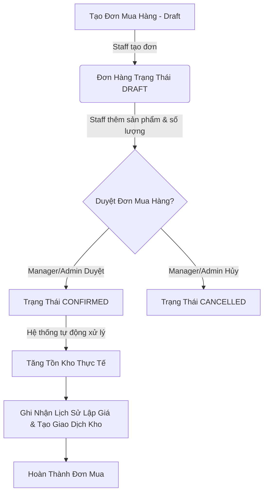
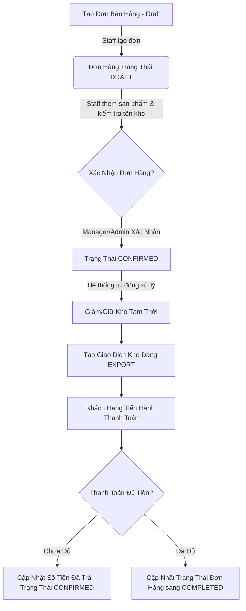

# Mini ERP System - Tài Liệu Dự Án Toàn Diện

Hệ thống **Mini ERP** là giải pháp quản lý nguồn lực doanh nghiệp thu nhỏ, hỗ trợ quản trị danh mục sản phẩm, khách hàng, nhà cung cấp, quản lý quy trình Mua hàng (Purchase Order), Bán hàng (Sales Order), theo dõi Tồn kho (Inventory Transactions), Thanh toán (Payments) và báo cáo doanh thu tự động qua các Tác vụ nền (Background Jobs).

---

## 1. Công Nghệ Sử Dụng

Dự án được xây dựng dựa trên những công nghệ hiện đại, đảm bảo tính bảo mật, hiệu năng cao và khả năng mở rộng:

*   **Core API**: .NET 9.0 (ASP.NET Core Web API).
*   **Database**: PostgreSQL 15.
*   **ORM**: Entity Framework Core 9 (EF Core) hỗ trợ LINQ, Migrations và Optimistic Concurrency.
*   **Background Jobs**: Hangfire (sử dụng PostgreSQL Storage để quản lý tác vụ chạy ngầm).
*   **Security & Auth**: JWT (JSON Web Token) kết hợp Policy-Based Authorization.
*   **Thư viện hỗ trợ**:
    *   *FluentValidation*: Kiểm tra tính hợp lệ dữ liệu đầu vào.
    *   *BCrypt.Net*: Mã hóa mật khẩu bảo mật cao.
    *   *CsvHelper*: Hỗ trợ xuất dữ liệu báo cáo dạng stream để tối ưu bộ nhớ.
*   **Containerization**: Docker & Docker Compose.

---

## 2. Thiết Kế Cơ Sở Dữ Liệu (Database Design)

Hệ thống cơ sở dữ liệu được thiết kế chuẩn hóa để lưu trữ thông tin nghiệp vụ và nhật ký giao dịch:

### Sơ đồ thực thể chính:
1.  **Hệ thống phân quyền**: `users`, `roles`, `user_roles` (bảng trung gian phân quyền N-N).
2.  **Danh mục đối tác**: `customers`, `suppliers`.
3.  **Hàng hóa**: `categories`, `products`, `product_price_histories` (lịch sử thay đổi giá sản phẩm).
4.  **Mua hàng**: `purchase_orders` (đơn mua), `purchase_order_items` (chi tiết đơn mua).
5.  **Bán hàng & Thanh toán**: `sales_orders` (đơn bán), `sales_order_items` (chi tiết đơn bán), `payments` (nhật ký thanh toán đơn bán).
6.  **Kho hàng**: `stock_transactions` (lịch sử xuất/nhập kho).
7.  **Báo cáo**: `daily_summaries` (tổng hợp báo cáo hằng ngày).

### Các tính năng nâng cao trong Database:
*   **Soft Delete**: Tất cả thực thể quan trọng đều kế thừa từ `BaseEntity` chứa các trường `created_at`, `updated_at`, `deleted_at`. Hệ thống áp dụng **Global Query Filter** để tự động ẩn các bản ghi đã xóa mềm.
*   **Optimistic Concurrency**: Sử dụng cột `xmin` (System Column của PostgreSQL) làm mã phiên bản để tránh xung đột dữ liệu khi nhiều tác vụ ghi đè cùng lúc.
*   **Indexes**: Đánh chỉ mục (Index) trên `sku`, `product_id`, `created_at` và áp dụng **Partial Index** (`WHERE deleted_at IS NULL`) để tối ưu hóa tốc độ truy vấn phân trang và tìm kiếm.

---

## 3. Phân Quyền Hệ Thống (Role & Permission Policy)

Hệ thống triển khai phân quyền dựa trên chính sách tập trung (**Policy-Based Authorization**) thay vì kiểm tra chuỗi Role cứng. Có 4 Role chính:
1.  **ADMIN**: Toàn quyền hệ thống.
2.  **MANAGER**: Quản lý nghiệp vụ bán hàng, phê duyệt đơn mua, xem báo cáo.
3.  **STAFF**: Nhân viên thực hiện nhập liệu, tạo đơn mua/bán hàng, xử lý kho.
4.  **ACCOUNTANT**: Kế toán xử lý thanh toán và xem báo cáo tài chính.

### Danh sách các Policy áp dụng trên API:

| Tên Policy | Quyền hạn (Roles được phép) | Mục đích sử dụng |
| :--- | :--- | :--- |
| `RequireAdmin` | `ADMIN` | Quản lý User và gán quyền |
| `RequireReadAccess` | `ADMIN`, `MANAGER`, `STAFF`, `ACCOUNTANT` | Đọc dữ liệu danh mục chung |
| `RequireWriteAccess` | `ADMIN`, `MANAGER`, `STAFF` | Thêm/Sửa đổi danh mục sản phẩm/đối tác |
| `RequireOrderRead` | `ADMIN`, `MANAGER`, `STAFF` | Xem đơn mua hàng và đơn bán hàng |
| `RequireOrderCreate` | `ADMIN`, `STAFF` | Tạo và cập nhật đơn mua/bán ở trạng thái nháp |
| `RequireOrderApprove`| `ADMIN`, `MANAGER` | Phê duyệt nhập hàng hoặc xác nhận bán hàng |
| `RequireInventoryWrite`| `ADMIN`, `STAFF` | Thực hiện xuất/nhập kho thủ công |
| `RequirePaymentRead` | `ADMIN`, `ACCOUNTANT`, `STAFF` | Xem lịch sử thanh toán |
| `RequirePaymentWrite`| `ADMIN`, `ACCOUNTANT` | Ghi nhận thanh toán mới cho đơn hàng |
| `RequireReportAccess`| `ADMIN`, `MANAGER`, `ACCOUNTANT` | Xem báo cáo tổng hợp và tải dữ liệu báo cáo |

---

## 4. Quy Trình Mua Hàng (Purchase Order Flow)

Quy trình Mua hàng dùng để nhập kho sản phẩm từ Nhà cung cấp:



### Điểm đặc biệt:
*   Khi đơn mua hàng chuyển sang `CONFIRMED`, hệ thống sử dụng **Database Transaction** để tăng tồn kho của sản phẩm, ghi nhận lịch sử thay đổi giá mua đầu vào (`product_price_histories`), và ghi nhật ký giao dịch kho (`stock_transactions`) một cách đồng bộ.

---

## 5. Quy Trình Bán Hàng & Thanh Toán (Sales Order Flow)

Quy trình Bán hàng dùng để xuất kho và thu tiền từ Khách hàng:



### Điểm đặc biệt:
*   Chỉ khi đơn bán hàng chuyển sang `CONFIRMED` thì kho mới thực tế bị trừ.
*   Trạng thái đơn bán tự động chuyển từ `CONFIRMED` sang `COMPLETED` ngay khi tổng số tiền trong các bản ghi thanh toán (`payments`) bằng hoặc vượt quá tổng giá trị đơn hàng.

---

## 6. Cơ Chế Xử Lý Giao Dịch & Tránh OOM (Transaction & Performance Handling)

### Quản lý Transaction (ACID)
Mọi thao tác thay đổi trạng thái đơn hàng (từ Draft sang Confirmed) đều liên quan đến nhiều bảng dữ liệu (cập nhật tồn kho, ghi log kho, ghi lịch sử giá, lưu thông tin đơn). Hệ thống sử dụng `IDbContextTransaction` của EF Core để đảm bảo tính toàn vẹn dữ liệu:
*   Nếu bất kỳ bước nào trong chuỗi xử lý bị lỗi (ví dụ: kho không đủ hàng), toàn bộ các thay đổi trước đó sẽ bị **Rollback** (hủy bỏ) để tránh tình trạng dữ liệu mâu thuẫn.

### Tối ưu hóa chống tràn bộ nhớ (Out-Of-Memory - OOM) khi xuất báo cáo
Khi người dùng xuất báo cáo bán hàng dạng CSV với khoảng thời gian dài, lượng dữ liệu có thể lên tới hàng triệu dòng. Hệ thống xử lý tối ưu bằng cách:
*   Sử dụng **`IAsyncEnumerable<T>`** để stream dữ liệu từ PostgreSQL lên theo từng đợt nhỏ (chunk) thay vì tải toàn bộ dữ liệu vào RAM cùng lúc.
*   Kết hợp với **`CsvHelper`** viết trực tiếp dữ liệu dạng văn bản vào `Response.BodyWriter` và giải phóng bộ nhớ RAM liên tục.

---

## 7. Tác Vụ Chạy Ngầm & Báo Cáo (Report & Background Job)

### Daily Summary Job (Hangfire)
Hệ thống thiết lập một Job chạy nền tự động vào lúc **00:05 hằng ngày (giờ Việt Nam)** để tổng hợp dữ liệu của ngày hôm trước và lưu vào bảng `daily_summaries`:
*   Tổng doanh thu từ bán hàng.
*   Tổng chi phí mua hàng.
*   Tổng số đơn hàng.
*   Số lượng sản phẩm sắp hết kho (tồn kho $\le 10$).

Job được thiết kế dạng **Upsert (luỹ đẳng)**, cho phép chạy lại nhiều lần cho cùng một ngày mà không bị nhân đôi dữ liệu.

---

## 8. Hướng Dẫn Cài Đặt và Khởi Chạy

### Cách 1: Chạy Local (Không dùng Docker)

**Yêu cầu:** Máy tính đã cài .NET 9 SDK và PostgreSQL.

1.  **Cấu hình Database**:
    Mở file `MiniERP/appsettings.json`, chỉnh sửa chuỗi kết nối `DefaultConnection` phù hợp với tài khoản PostgreSQL của bạn.
2.  **Khởi chạy**:
    Tại thư mục gốc dự án, chạy lệnh:
    ```bash
    dotnet run --project MiniERP/MiniERP.csproj
    ```
    Hệ thống sẽ tự động chạy Migrations để tạo bảng và dữ liệu mẫu.

---

### Cách 2: Chạy Bằng Docker (Khuyên Dùng)

**Yêu cầu:** Máy tính đã cài Docker và Docker Desktop.

1.  **Tạo file cấu hình**:
    Sao chép file `.env.example` thành file `.env` ở thư mục gốc:
    ```bash
    cp .env.example .env
    ```
    *(Mở file `.env` ra và điền mật khẩu database tùy ý của bạn)*.
2.  **Khởi động các dịch vụ**:
    Chạy lệnh sau tại thư mục gốc:
    ```bash
    docker-compose up -d --build
    ```
3.  **Truy cập hệ thống**:
    *   **API Healthcheck**: [http://localhost:8080/api/health](http://localhost:8080/api/health)
    *   **Tài liệu API (Swagger UI)**: [http://localhost:8080/swagger](http://localhost:8080/swagger)
    *   **Quản lý Tác vụ nền (Hangfire Dashboard)**: [http://localhost:8080/hangfire](http://localhost:8080/hangfire)
    *   **Xem Database qua pgAdmin**: Kết nối tới `localhost` cổng `5433` bằng tài khoản và mật khẩu bạn đã điền trong file `.env`.

---

## 9. Tài Khoản Đăng Nhập Mẫu (Seed Data)
Hệ thống tự động tạo sẵn tài khoản quản trị tối cao để bạn thử nghiệm:
*   **Email**: `admin@example.com`
*   **Mật khẩu**: `admin123`
*(Bạn có thể dùng tài khoản này đăng nhập qua API `/api/auth/login` để lấy JWT token và sử dụng Swagger).*
